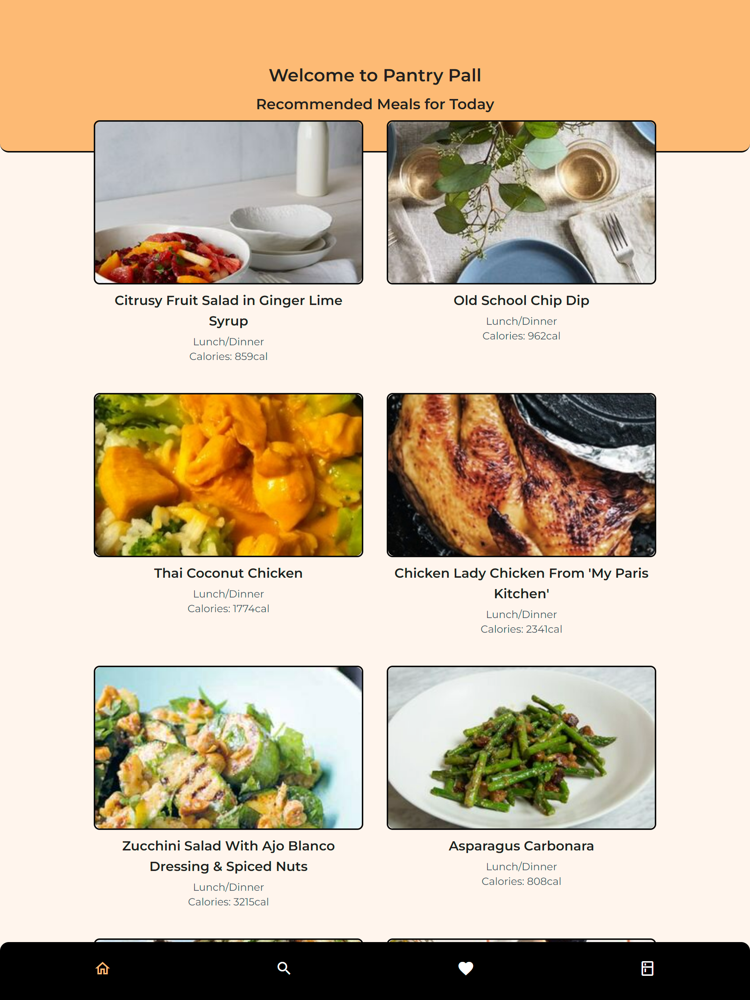
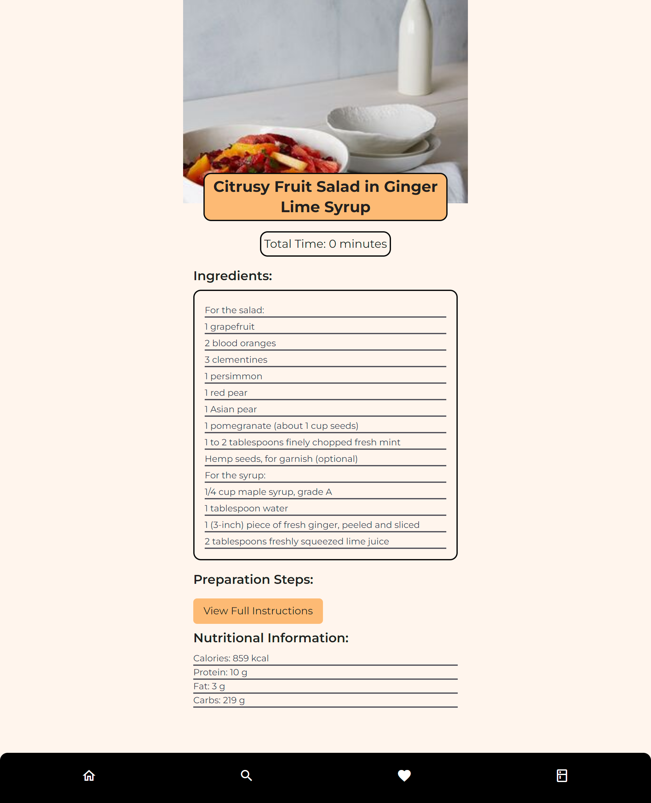
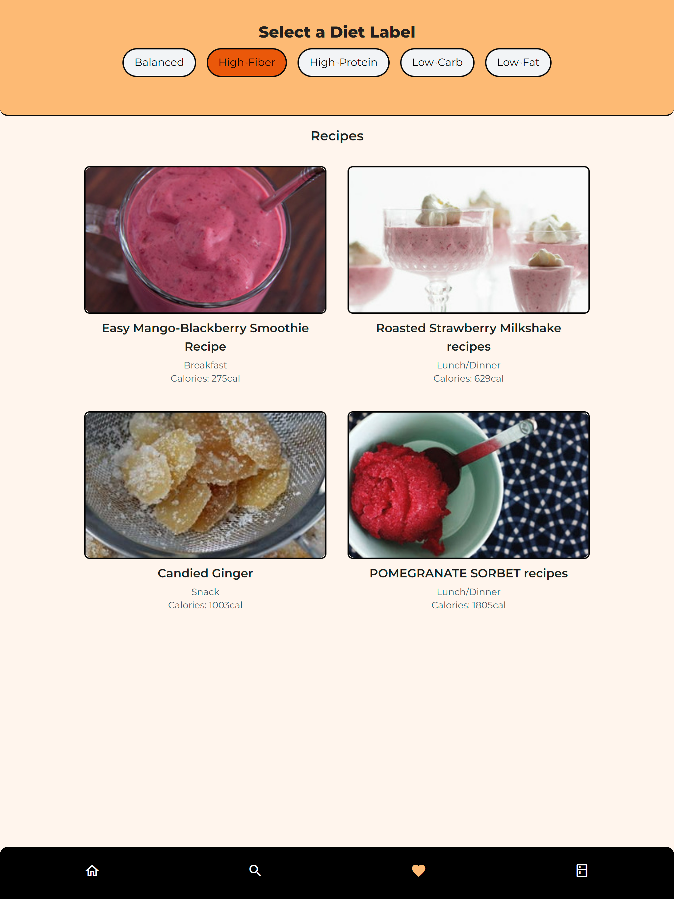

# PantryPal 🍽️

## Project Overview

**PantryPal** is a smart recipe management app that helps users discover meals based on their pantry items and dietary preferences. Whether you're looking for high-protein meals, fiber-rich options, or simply want to whip up something with what's on hand, PantryPal has you covered. With API integration, users can search, filter, and explore recipes with ease.

## Features

- **Recipe Search by Pantry**: Search for recipes using items you already have at home.
- **Dietary Preferences**: Filter meals based on dietary needs such as high protein, high carbs, fiber, etc.
- **Pantry Management**: Add ingredients to your pantry and see relevant meal suggestions.
- **API Integration**: Fetches a wide variety of recipes from a meal API.
- **Responsive Design**: Works smoothly across all devices, providing an intuitive experience.

## Technologies Used

- **React**
- **API Integration**
- **JavaScript**
- **HTML**
- **CSS**

## Live Demo

[Explore PantryPal](https://pantrypall.netlify.app)

## Repository

[GitHub Repository](https://github.com/claudiooleite/pantrypall)

## Screenshots

### Home Page

### Recipe Page

### Pantry Page

